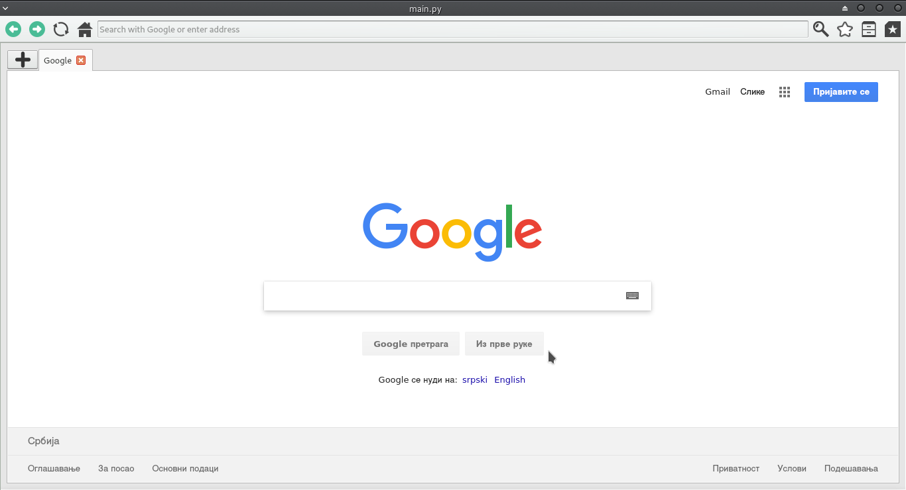

# Python browser
Simplified web browser made in python for a college project.
Web browser has bookmarks, history, multiple tabs, toolbar.
It was made on Ubuntu for Ubuntu.



## Setup

1. Install PyQt5
    Ubuntu
    ```sh
    sudo apt-get install python3-pyqt5	

    ```

2. Install QtWebKit

    ```sh
    sudo apt-get install python3-pyqt5.qtwebkit
    ```
3. Run
    ```sh
    python3 main.py 
    ```
***
## Meta

Lazar Bojanic<br>
[@Linkedin](https://www.linkedin.com/in/lbojanic/)<br>
lazar.bojanic@hotmail.rs<br>
[@GitHub](https://github.com/LBojanic)<br>
<br>
Djordje Dimovic <br>
[@Linkedin](https://www.linkedin.com/in/dimovicd/)<br>
dimovicdj@gmail.com<br>
[@GitHub](https://github.com/dimovicdj)
